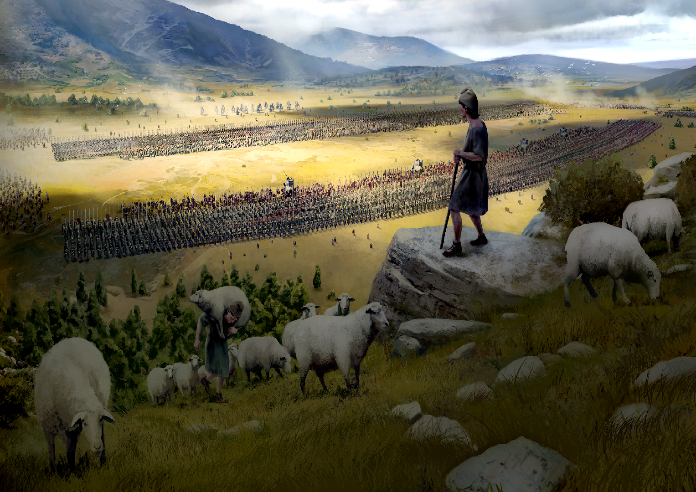

# Jomini GUI Pixel Shaders

A collection of 20+ Pixel shaders meant to be used on GUI elements for Jomini based paradox games. This was made in Imperator Rome but Crusader Kings III and Victoria 3 both use the exact same default gui pixel shader so these shaders will work on all 3 of those games.

# How to Use

The only files from this repo you will need to put in your mod are `gfx/FX/GUI_default.shader`, `gfx/FX/GUI_pushbutton.shader`and `gfx/FX/GUI_animated.shader`

First you'll need to make a special gui type that uses the new pixel shader like this:
```
types ShaderTypes
{
	type shader_icon = icon {
		gfxtype = icongfx
		shaderfile = "gfx/FX/GUI_default.shader"
		using = tooltip_es
	}
}
```
Alternatively you can just override an existing widgets `shaderfile` property with the new shader and it will also work.

To apply a pixel shader to a gui element the `effectname` property is used like this:
```
shader_icon = {
	effectname = "GuiSaturate"
	texture = "gfx/loadingscreens/load_9.dds"
	size = { 1500 1000 }
}
```
OR
```
icon = {
	effectname = "GuiSaturate"
	shaderfile = "gfx/FX/GUI_default.shader"
	texture = "gfx/loadingscreens/load_9.dds"
	size = { 1500 1000 }
}
```

Note that if you are using these on Victoria 3 you'll have to go into both the shader files and replace one of the fxh includes so `GlobalTime` can be included correctly.

These shaders can be used on any gui widget that normally use the `shaderfile = "pdxgui_default.shader"`. However they can be applied to any shader but the pixel shader code and shader effects will need to be updated with that specific shaders vanilla code, which is very easy to do. If you need the effects for another shader (`pdxgui_texticon.shader for example`) open up an issue and i'll get to it eventually or do it yourself and put up a pull request.

The full list of usable `effectname` parameters are:

## PostProcessing Effects

1. GuiSaturate - Saturate a textures colors
2. GuiVibrance - Make a textures colors more vibrant
3. GuiEdges - Make the edges of objects in a texture pop out
4. GuiCrossProcessing - Mimics the look of crossprocessed film
5. [GuiCellShade](https://www.shadertoy.com/view/XlSSRW) - Cell shading, also called a Toon shader, makes textures look like a comic book 
6. GuiBloom - Bloom shader that makes bright parts of an texture pop out more without making them too bright
7. GuiVignet - Puts a faded black border around a texture, puts more focus on the center of the texture
8. GuiPosterize - Reduce the number of tones in a texture
9. GuiEmboss - Subtle embossing effect
10. GuiColorGrading - Makes a texture look like you just crossed the border into  Mexico in Breaking Bad
11. GuiPlasticWrap - Makes a texture look like it was wrapped in plastic, lightens edges.
12. [GuiSharpen](https://www.shadertoy.com/view/4tcGW2) - Sharpen a texture
13. GuiGloom - Makes the texture look "gloomy"
14. [GuiOilPainting](https://www.shadertoy.com/view/MtKcDG) - Makes the texture look like an oil painting

## Special Shader Effects
1. GuiDreamView - Draws a circular pattern that looks like a dream.
2. [GuiChromaticAberration](https://www.shadertoy.com/view/Mds3zn) - Linear chromatic abberation that shifts horizontally
3. GuiAberration - Static chromatic abberation effect
4. GuiShakyColor - Shakes the colors of the texture back and forth
5. GuiUnderwaterBlur - Heavy underwater blur effect with a lot of movement
6. GuiKaleidoscope - Turns a texture into a Kaleidoscope
7. [GuiCameraFilm](https://www.shadertoy.com/view/4t2fRz) - Applies a camera film filter over the texture, makes it look like an old TV screen.
8. [GuiHueShift](https://www.shadertoy.com/view/MdjBRy) - Shifts the hue of a texture between several colors over time

## Animated Shaders

There is a separate file named `GUI_animated.shader` that has several animated shader effects in it. Use it in the same way you would use the other effects, the shaders include:
1. [StormyNight](https://www.shadertoy.com/view/XsX3DS) - Clouds, rain, lightning, and the moon at night
2. [CloudCover](https://www.shadertoy.com/view/WdXBW4) - Scrolling clouds at dawn
3. [BigBang](https://www.shadertoy.com/view/MdXSzS) - Big spiral galaxy spinning
4. [StarField](https://www.shadertoy.com/view/XlfGRj) - Large star field with twinkling stars and slow moving nebulas

## Screenshots

#### Original Texture 


#### Saturate


#### Edges



#### Posterize


#### Cell Shade


#### Dream


#### Abberation


## License
[Creative Commons Attribution-NonCommercial-ShareAlike 3.0 Unported License](https://creativecommons.org/licenses/by-nc-sa/3.0/deed.en_US)